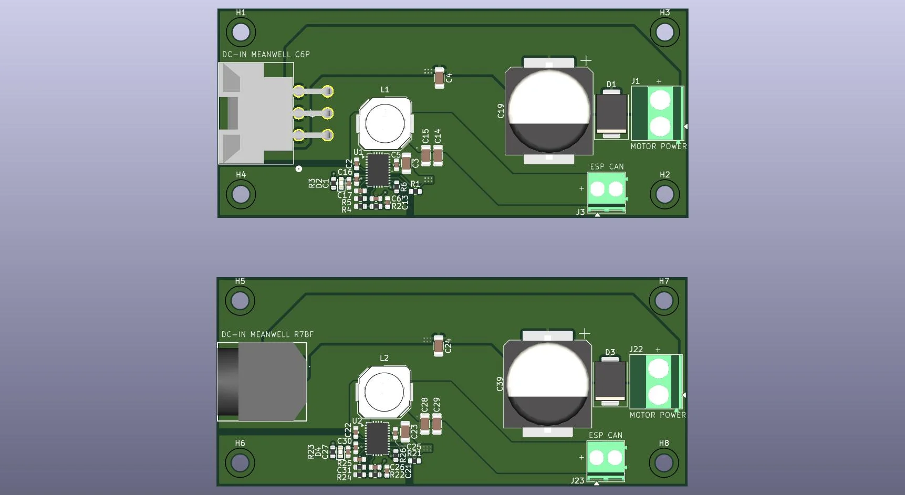

# OSSM-RS Powerboard

Power management PCB for AIM family motors, designed to pair with the Industrial ESP32-S3-RS485-CAN control board by Waveshare and run with OSSM-RS software.

This board is inspired by and builds on the OSSM hardware concept from KinkyMakers:
- OSSM-RS software: https://github.com/ossm-rs/ossm
- Original OSSM hardware/research: https://github.com/KinkyMakers/OSSM-hardware/tree/main

## What This Board Does

- Accepts DC input from an external power supply.
- Provides 24-36v output for the servo motor.
- Protects from back EMF.
- Provides regulated 12V output for the controller board.
- Supports two input connector variants in this repository:
	- C6P input variant (Molex-style connector).
	- R7BF input variant (barrel jack style, Kycon KPJX-4S).

## System

- Motor family:
	- 60aim40F
	- 57aim30
- Controller:
	- Waveshare Industrial ESP32-S3-RS485-CAN
- PSU
    - Meanwell GST220A36-R7BF
    - Meanwell GST360A36-C6P

Other motor configurations that use 24-36V may also work, but they have not been validated on this board yet.

## Board Variants

- C6P variant:
	- Input connector: C6P 6 Pin Molex footprint
	- Fabrication files prefix: `C6P_*`
	- STEP model: `STEP/powerboard-C6P.step`
- R7BF variant:
	- Input connector: R7BF KPJX-4S footprint
	- Fabrication files prefix: `R7BF_*`
	- STEP model: `STEP/powerboard-R7BF.step`

Do not populate both input connector styles on the same board.

## Usage

1. External PSU (C6P or R7BF style) feeds the selected DC-IN connector on this board.
2. Board conditions/protects input and generates regulated 12V rail.
3. Motor power is provided at the Motor Power output terminal.
4. 12V and GND for the Waveshare board are provided at the ESP/CAN power terminal.
5. Motor control and comms (CAN/RS485) are handled by the Waveshare board and motor harness.
6. Configure and run OSSM-RS from https://github.com/ossm-rs/ossm.

Use the wiring diagram image below and verify polarity before first power-up.

## Manufacturing

For assembly orders, use files in `jlcpcb-fabrication-files/`:
- `*_bom.csv` for component list
- `*_positions.csv` for pick-and-place positions

This project is intended for small community group buys through JLCPCB (or another PCB manufacturer). As of 2026-03-17, a typical minimum order on JLCPCB is 5 boards and costs about EUR 100 total.

Estimated cost per board:
- PCB-only share: about EUR 20 per board (EUR 100 / 5)
- With shipping split across 5 boards: about (EUR 100 + shipping) / 5 per board

## Safety Notes

- This is a high-current motor power board; incorrect wiring can damage electronics.
- Always verify connector pinout/polarity against schematic and wiring diagrams.
- Start with current-limited power during first test.
- Keep wiring secure and strain-relieved.

## Credits

- OSSM-RS maintainers and contributors
- KinkyMakers OSSM hardware project and community research
